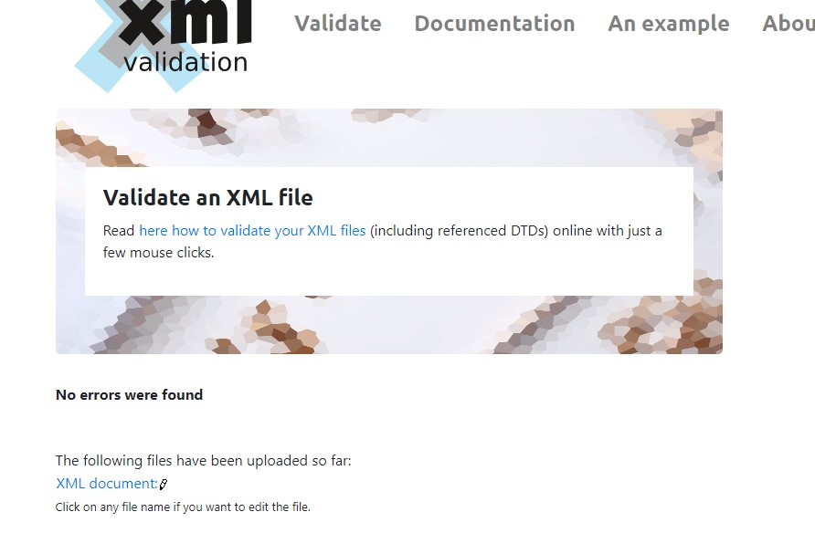
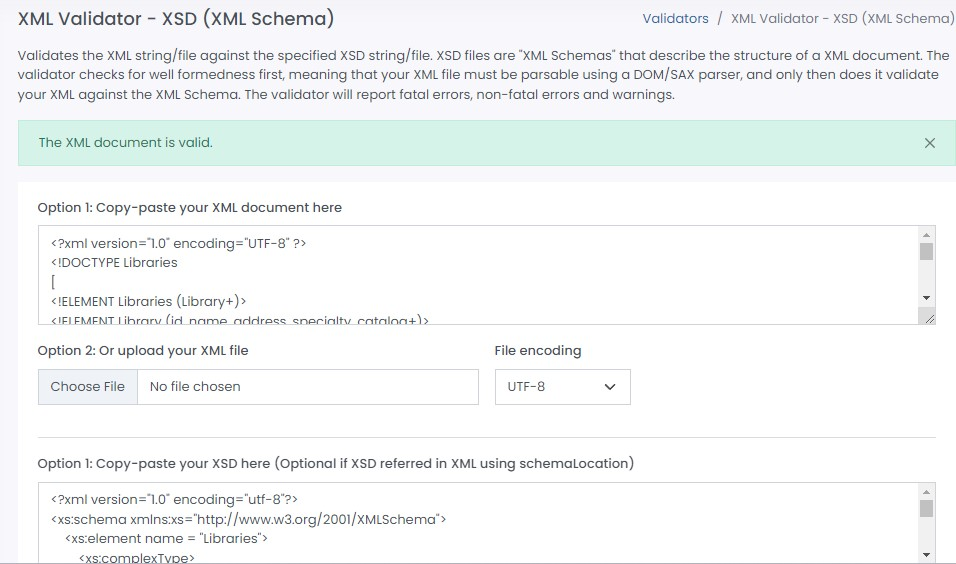
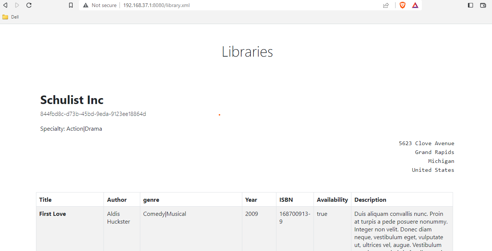
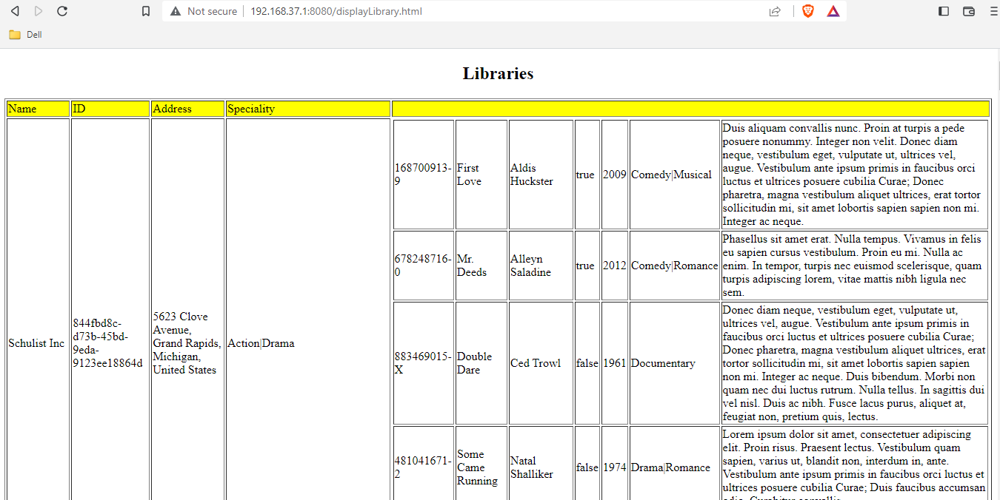

#Project-1 

To start, I reviewed the structure of the provided JSON file and convert it to XML. Once I had the XML file, I created a list of elements and attributes, and identified their relationship or occurrence in the document. This helped me to better understand the structure of the document and the types of data that is to be included.

Next, it's important to define the data types for each element and attribute, ensuring that the data is correctly formatted and can be validated properly. With this information, I began writing the DTD, which outlines the structure of the document, including the elements and attributes that will be included.

To ensure that the DTD is accurate and complete, I validated it using the XML + DTD validator

Once DTD was in place, I used it as a base to define the elements and their types in the XSD. Categorizing the elements into groups to make it easier to understand and organize. Finally, validated the XSD using an XSD validator to ensure that it is accurate and meets the required specifications.

I created the HTML file and parsed the XML file to HTML in Table format.
The files created by me are as:
1. library.xml
2. library.xsd
3. displayLibrary.html

The screenshot are as:

