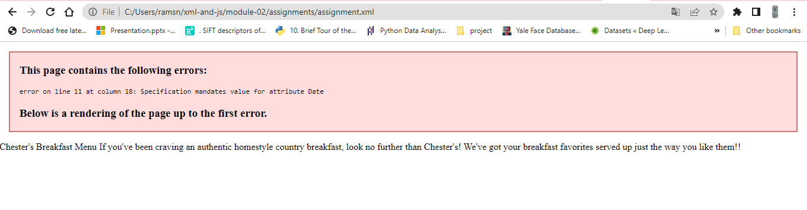
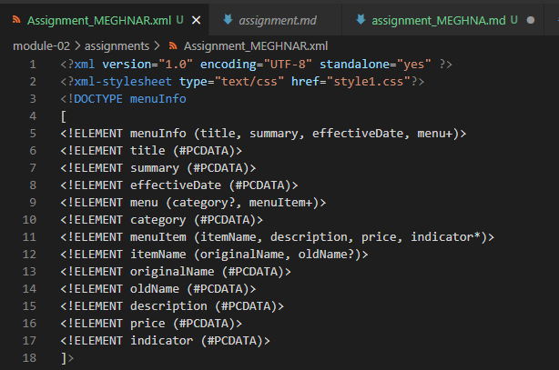
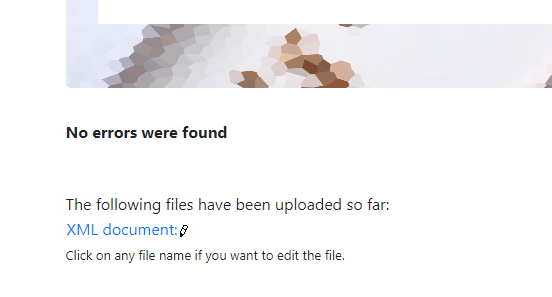
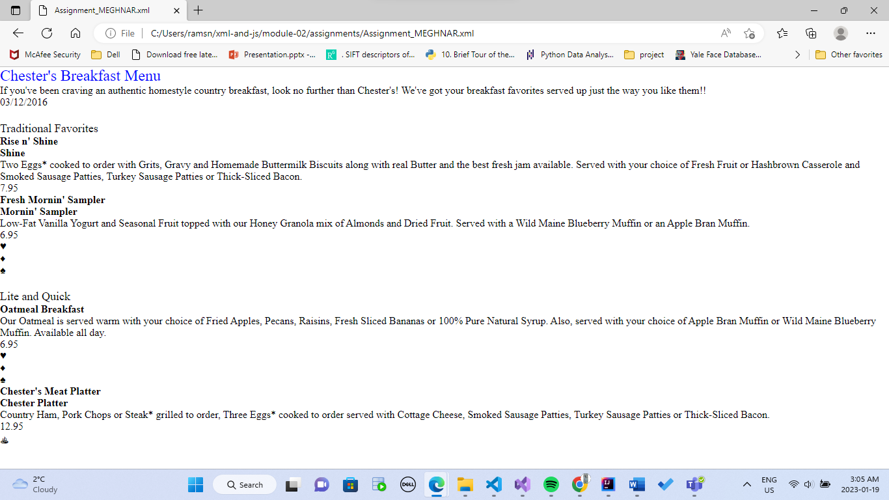
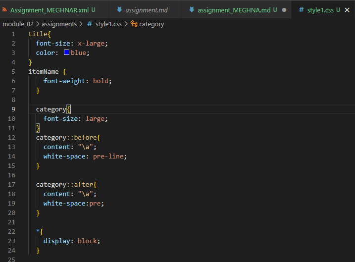

# Assignment 1
Answer 1
    
    Error were as follows:
        1. Line 11 - Tag name cannot contain space
        2. Line 31, 51 - Opening and closing tag should be same, even the case should be same.
Answer 2
    CDATA is used to suppress the parsing of special characters and retain the format of the data typed in.
Answer 3
    
Answer 4
    Prolog entails the document type declaration and the encoding
    Body contains the "ROOT" element with processing instructions.
    Epilog is the end part of XML file, can consist of processing instructions or comments.
    No, this document doesn't contain any processing information.
Answer 5
    
Answer 6
    
Answer 7
    
    