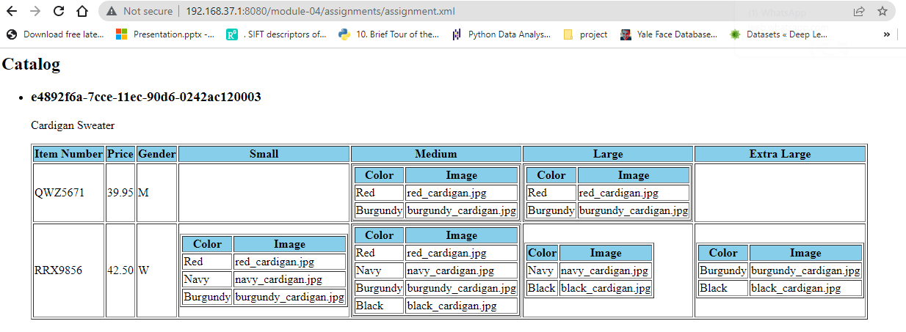

# Assignment 4

1. Firstly, creating h2 tag for the Catalog title
2. making HTML element to display the details
3. creating the templates to be applied
4. defining the templates with all the conditions required.
5. using 'Choose' condition to choose between Men and Women
6. using if condition for selecting the sizes.
